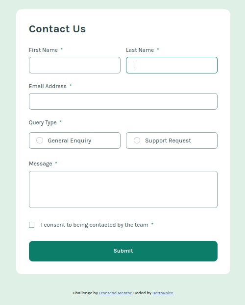
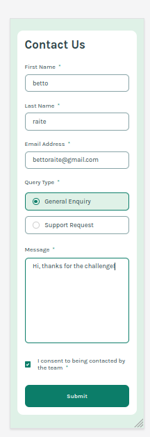
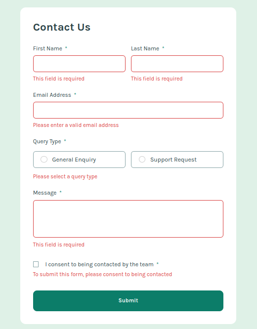

# Frontend Mentor - Contact form solution

This is a solution to the [Contact form challenge on Frontend Mentor](https://www.frontendmentor.io/challenges/contact-form--G-hYlqKJj). Frontend Mentor challenges help you improve your coding skills by building realistic projects. 

## Table of contents

- [Frontend Mentor - Contact form solution](#frontend-mentor---contact-form-solution)
	- [Table of contents](#table-of-contents)
	- [Overview](#overview)
		- [The challenge](#the-challenge)
		- [Screenshot](#screenshot)
		- [Links](#links)
	- [My process](#my-process)
		- [Built with](#built-with)
		- [What I learned](#what-i-learned)
		- [Continued development](#continued-development)
	- [Author](#author)

**Note: Delete this note and update the table of contents based on what sections you keep.**

## Overview
****
### The challenge

Users should be able to:

[+]: Complete the form and see a success toast message upon successful submission
[+]: Receive form validation messages if:
  - A required field has been missed
  - The email address is not formatted correctly
  
[+]: Complete the form only using their keyboard.
[+]: Have inputs, error messages, and the success message announced on their screen reader. (Partially done.)
[+]: View the optimal layout for the interface depending on their device's screen size
[+]: See hover and focus states for all interactive elements on the page

### Screenshot

PC version.


---

Mobile version. (Note, if you zoom out in librewolf the input checkbox(rounded) starts to look odd.)


---

Error state.



### Links

- Solution URL: [Root repo](https://github.com/BettoRaite/front-end-challenges/tree/master)
- Live Site URL: [View demo](https://contact-form-bettoraite.vercel.app/)

## My process

### Built with

- Semantic HTML5 markup
- CSS custom properties
- Flexbox
- CSS Grid
- [React](https://reactjs.org/) - JS library
- [Styled Components](https://styled-components.com/) - For styles

**Note: These are just examples. Delete this note and replace the list above with your own choices**

### What I learned

Throughout this journey of building this form a couple of new things.
- Input needs label(better accessability).
  Input has all those useful attributes(props). 
```html
<label htmlFor="firstname"></label>
<input [aria-describe-by]="name-input-error" type="text" id="firstname" autoComplete="name" />
<span id="name-input-error">this is some error
  which is read by screenreaders.
</span>
```
- You can easily create a component which helps a ton with reusability.
```tsx
<InputWithLabel
						inputError={{
							showError: errorFieldNames.includes("firstName"),
						}}
						value={formData.firstName}
						onChange={handleChange}
						inputProps={{
							name: "firstName",
							id: "firstname",
							maxLength: MAX_TEXT_INPUT_LENGTH,
							autoComplete: "name",
							"aria-describedby": "first-name-error",
						}}
						label={{
							labelContent: "first name",
							isCapitalized: true,
							isRequired: true,
						}}
					/>
```
- The thing that pops up at the top is called toast notification.
- Well, yea, the challenge was rather easy, turns out I have not learned much)

### Continued development
Things that I suck at.
- Accessability
Not sure how websites should be built to be the most accessible.
- Planning
At the beginning I spent lots of time rewritting css here and there. Instead	 what I could do is to spend some more time on analyzing the website design and finding all those repeating patters.
- Naming (I better say nothing...)


## Author

- Github - [BettoRaite](https://github.com/BettoRaite)
- Frontend Mentor - [@BettoRaite](https://www.frontendmentor.io/profile/BettoRaite)

